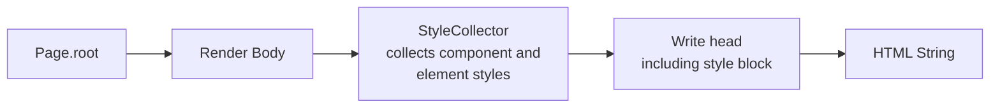

# Blatt

**HTML and CSS in pure Java – no template engine, no `.html`, no `.css`.**

[](https://openjdk.org/)
[](https://javalin.io/)
[](https://maven.apache.org/)
[](https://github.com/ezTxmMC/blatt/releases)

```java
@Route("/")
public final class HomeRoute implements Page {

    @Override
    public Component root() {
        return new Main(
            new Heading(1, new Text("Hello Blatt")),
            new Button(new Text("Click me"))
                .style(new Style().padding(Css.rem(0.75), Css.rem(1.5)))
                .on(":hover", new Style().backgroundColor(Css.hex("4338ca")))
                .onClick("alert('Hello')")
        );
    }
}
```

No string concatenation, no template parser: pages are typed Java objects that render themselves. The compiler knows your tags, your attributes, and your styles.

---

## Table of Contents

- [Highlights](#highlights)
- [Installation](#installation)
- [Quickstart](#quickstart)
- [Elements](#elements)
- [CSS in Java](#css-in-java)
- [Per-Element Styling](#per-element-styling)
- [Components with Scoped Styles](#components-with-scoped-styles)
- [Routing and Server](#routing-and-server)
- [How Rendering Works](#how-rendering-works)
- [Project Structure](#project-structure)
- [Building and Testing](#building-and-testing)
- [Limitations](#limitations)

---

## Highlights

| | |
|---|---|
| **94 Elements** | From `Div` to `Dialog`, with typed attributes: `colSpan(int)`, `open()`, `forId(…)` |
| **CSS DSL** | Stylesheets, media queries, keyframes, custom properties – all in Java |
| **Per-Element Styling** | `.style(…)` inline, `.on(":hover", …)` as a real rule – content-deduplicated |
| **Scoped Components** | `@Component` encapsulates CSS per component, without naming conventions |
| **Automatic CSS** | Component styles land in `<head>` automatically – no registration required |
| **Escaping Everywhere** | Text, attributes, and CSS values are escaped before leaving the document |
| **No Runtime Magic** | No reflection rendering, no bytecode weaving – just objects and a `StringBuilder` |

---

## Installation

Blatt is hosted on GitHub Packages. Add this to your `pom.xml`:

```xml
<repositories>
    <repository>
        <id>github</id>
        <url>https://maven.pkg.github.com/ezTxmMC/blatt</url>
    </repository>
</repositories>

<dependencies>
    <dependency>
        <groupId>de.eztxm</groupId>
        <artifactId>blatt</artifactId>
        <version>1.0.0-alpha.9</version>
    </dependency>
</dependencies>
```

GitHub Packages requires authentication. Add this to `~/.m2/settings.xml`:

```xml
<servers>
    <server>
        <id>github</id>
        <username>YOUR_GITHUB_USERNAME</username>
        <password>YOUR_PERSONAL_ACCESS_TOKEN</password>
    </server>
</servers>
```

The token only requires `read:packages` scope. **Java 17** or newer is required.

---

## Quickstart

**1. A Route.** A class annotated with `@Route` implementing `Page` represents a page:

```java
@Route("/")
public final class CounterRoute implements Page {

    @Override
    public Component root() {
        return new Main(
            new Heading(1, new Text("Counter")),
            new Paragraph(new Text("0")).id("count"),
            new Button(new Text("Increment")).onClick("""
                const count = document.getElementById('count');
                count.textContent = ++count.textContent;
                """)
        ).cssClass("counter");
    }

    @Override
    public StyleSheet styles() {
        return new StyleSheet()
            .rule(".counter", new Style()
                .display("flex")
                .flexDirection("column")
                .gap(Css.rem(1)));
    }
}
```

**2. The Server.** `RouteScanner` finds all `@Route` classes in the specified package:

```java
public final class App {

    public static void main(String[] args) {
        Router router = new Router()
            .staticFiles(Paths.get("public"))
            .style(Baseline.reset());

        new RouteScanner("de.example.app").scan(router);

        HeadConfig head = new HeadConfig().title("My App");

        new BlattServer(router, head, 7171).start();
    }
}
```

Done – `http://localhost:7171`. If you don't need a server, render directly:

```java
String html = new Document(page.root(), head).render();
```

---

## Elements

Every element is its own class in `de.eztxm.blatt.element`. Children are passed into the constructor, attributes via fluent setters:

```java
new Anchor(new Text("To Docs"))
    .href("/docs")
    .target("_blank")
    .rel("noopener")
```

<details>
<summary><b>All 94 Elements</b></summary>

**Structure** · Html, Head, Body, Main, Header, Footer, Nav, Section, Article, Aside, Div, Span, HeadingGroup, Address, Menu, Template, Slot, NoScript

**Text** · Heading, Paragraph, Anchor, Strong, Emphasis, Small, Mark, Code, Preformatted, Quote, BlockQuote, Cite, Abbreviation, Time, Deleted, Inserted, Subscript, Superscript, Keyboard, Sample, Variable, Bold, Italic, Underline, Strikethrough

**Lists** · UnorderedList, OrderedList, ListItem, DescriptionList, DescriptionTerm, DescriptionDetails

**Tables** · Table, TableHead, TableBody, TableFoot, TableRow, Cell, HeaderCell, Caption, Column, ColumnGroup

**Forms** · Form, Label, Input, TextArea, Select, Option, OptionGroup, Button, FieldSet, Legend, DataList, Output, Progress, Meter, Details, Summary, Dialog

**Media** · Image, Picture, Source, Video, Audio, Track, Canvas, IFrame, Embed, Figure, FigureCaption

**Document** · Title, Link, Meta, Script

**Breaks** · LineBreak, HorizontalRule, WordBreak

</details>

Void elements – `Image`, `Input`, `Link`, `Meta`, `Source`, `Track`, `Column`, `Embed`, `LineBreak`, `HorizontalRule`, `WordBreak` – render without a closing tag.

Available on **every** element: `id`, `cssClass`, `style`, `on`, `attr`, `title`, `role`, `data`, `aria`, `tabIndex`, `hidden`, `onClick`. Thanks to self-types, method chains retain the concrete type regardless of order:

```java
new Button(new Text("Submit")).cssClass("primary").type("submit").disabled()
```

For anything without a dedicated method, use `attr(name, value)`.

---

## CSS in Java

`Style` collects declarations, `StyleSheet` collects rules:

```java
new StyleSheet()
    .variables(new Style()
        .variable("accent", Css.hex("4f46e5")))
    .rule("body", new Style()
        .display("grid")
        .placeItems("center")
        .minHeight(Css.vh(100)))
    .rule(new Rule(".action", new Style()
            .padding(Css.rem(0.75), Css.rem(1.5))
            .backgroundColor(Css.var("accent")))
        .on(":hover", new Style()
            .backgroundColor(Css.hex("4338ca"))))
    .media(MediaRule.maxWidth(Css.px(480))
        .rule(".action", new Style()
            .width(Css.percent(100))));
```

**Nesting** works like SCSS: `&` represents the parent selector; anything else becomes a descendant.

**Values** are provided by `Css`: `px`, `rem`, `em`, `percent`, `vh`, `vw`, `fr`, `seconds`, `millis`, `deg`, `hex`, `rgb`, `rgba`, `hsl`, `var`, `calc`, `clamp`, `min`, `max`, `repeat`, `url`, `quoted`.

**Animations** via `Keyframes`, **presets** via `Baseline.reset()` (includes a modern CSS reset and `prefers-reduced-motion`).

Stylesheets can be applied globally (`Router.style`), per route (`RouteEntry.style`), per page (`Page.styles()`), or per document (`HeadConfig.style`). If you still prefer external files, use `stylesheet("/app.css")`.

---

## Per-Element Styling

Inline styles cannot target `:hover`. That's why `on(...)` exists:

```java
new Anchor(new Text("More"))
    .style(new Style().color("inherit"))                    // → style="color:inherit;"
    .on(":hover", new Style().textDecoration("underline"))    // → .b-1:hover { … }
    .on("::after", new Style().content(Css.quoted(" *")))
```

During rendering, the element is assigned a generated class name and the rule moves to the document stylesheet. The string in `on(...)` is appended directly to the selector – enabling `":nth-child(2)"`, `":focus-visible"`, `" p"` (descendant), or `""` for base rules.

**Identical styles share classes.** Ten buttons with identical inline pseudo-styles generate exactly one CSS rule because the lookup key is built from the rendered CSS string. Custom `cssClass` definitions are preserved:

```html
<a href="#" style="color:inherit;" class="b-1">More</a>
```

---

## Components with Scoped Styles

`@Component` + `Widget` bundles markup and CSS into a reusable unit:

```java
@Component("card")
public final class CardWidget extends Widget {

    private final String title;

    public CardWidget(String title) {
        this.title = title;
    }

    @Override
    protected Element root() {
        return new Div(new Heading(2, new Text(title)).cssClass("title"));
    }

    @Override
    protected StyleSheet styles() {
        return new StyleSheet()
            .rule(new Rule("&", new Style().padding(Css.rem(1.25)))
                .on(":hover", new Style().transform("translateY(-2px)")))
            .rule(".title", new Style().color(Css.var("accent")));
    }
}
```

Usage is identical to standard elements – `new CardWidget("Title")`. CSS is pushed to the `<head>` automatically, rendered **once** regardless of instance count.

Every element in the component tree receives a scope attribute, and every selector receives a matching suffix:

```css
[data-card-1b64drv]        { padding: 1.25rem }
[data-card-1b64drv]:hover  { transform: translateY(-2px) }
.title[data-card-1b64drv]  { color: var(--accent) }
```

| Rule | Meaning |
|---|---|
| `&` | The component root itself |
| `.title` | Only `.title` **inside** this component |
| Nested component | Separate scope – `.title` inside a child component remains unaffected |
| Child component root | Inherits parent scope attribute so outer layout can target it |

Scope names originate from the annotation value (or fall back to class name) plus a stable hash of the fully qualified class name. `@Component(scoped = false)` disables scoping – useful for theme or reset components.

---

## Routing and Server

```java
Router router = new Router()
    .staticFiles(Paths.get("public"))   // static files
    .style(Baseline.reset())            // global CSS
    .script("/app.js");                 // global JS

new RouteScanner("de.example.app").scan(router);   // scan @Route annotations

router.register("/health", () -> new Div(new Text("ok")))   // manual registration
    .stylesheet("/extra.css");                             // route-specific stylesheet
```

`HeadConfig` configures document `<head>` defaults: `title`, `lang`, `script`, `stylesheet`, `style`. Merging happens in order: Base → Global → Page → Route:

```java
new BlattServer(router, new HeadConfig().title("App").lang("de"), 7171).start();
```

---

## How Rendering Works



The body is rendered **first** – allowing the `<head>` to know exactly which components were instantiated. As a result, the document contains only the required CSS and nothing extra.

---

## Project Structure

```
de.eztxm.blatt
├── BlattServer         Javalin integration
├── core                Component, Element, Tag<S>, VoidTag<S>, Markup,
│                       Text, Document, HeadConfig, HtmlWriter, Escaping
├── css                 Style, Rule, StyleSheet, MediaRule, Keyframes,
│                       Css, Baseline, ScopedSelector, StyleCollector
├── element             The 94 HTML elements
├── component           @Component, Widget, Scope
└── routing             @Route, Page, Router, RouteEntry, RouteScanner
```

---

## Building and Testing

```bash
mvn test        # 80 tests
mvn package     # JAR into target/
```

The example project in [`examples/`](examples/) is excluded from the main Maven build. To compile against the built JAR:

```bash
mvn dependency:build-classpath -Dmdep.outputFile=cp.txt
javac -cp "$(cat cp.txt):target/classes" -d out $(find examples -name '*.java')
java -cp "$(cat cp.txt):target/classes:out" de.eztxm.blatt.examples.ExampleApp
```

> On Windows, separate classpath entries with `;` instead of `:`.

---

## Limitations

- **Alpha status.** The API may change between versions.
- **Server-side only.** Blatt renders HTML; client interaction relies on `onClick` or custom JavaScript rather than client-side rendering.
- **`raw(...)` is unescaped.** `HtmlWriter.raw` and `StyleSheet.raw` output unescaped strings – do not pass untrusted user input to them. All other input is safely escaped.
- **Selector scoping targets descendants.** In `.a .b`, only `.b` is scoped; ancestor selector `.a` may exist outside the component scope.
