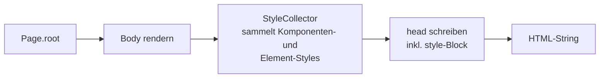

# Blatt

**HTML und CSS in purem Java – ohne Template-Engine, ohne `.html`, ohne `.css`.**

[](https://openjdk.org/)
[](https://javalin.io/)
[](https://maven.apache.org/)
[](https://github.com/ezTxmMC/blatt/releases)

```java
@Route("/")
public final class HomeRoute implements Page {

    @Override
    public Component root() {
        return new Main(
            new Heading(1, new Text("Hallo Blatt")),
            new Button(new Text("Klick mich"))
                .style(new Style().padding(Css.rem(0.75), Css.rem(1.5)))
                .on(":hover", new Style().backgroundColor(Css.hex("4338ca")))
                .onClick("alert('Moin')")
        );
    }
}
```

Kein String-Konkatenieren, kein Template-Parser: Seiten sind typisierte Java-Objekte, die sich selbst rendern. Der Compiler kennt deine Tags, deine Attribute und deine Styles.

---

## Inhalt

- [Highlights](#highlights)
- [Installation](#installation)
- [Schnellstart](#schnellstart)
- [Elemente](#elemente)
- [CSS in Java](#css-in-java)
- [Styling pro Element](#styling-pro-element)
- [Komponenten mit Scoped Styles](#komponenten-mit-scoped-styles)
- [Routing und Server](#routing-und-server)
- [Wie das Rendern abläuft](#wie-das-rendern-abläuft)
- [Projektstruktur](#projektstruktur)
- [Bauen und Testen](#bauen-und-testen)
- [Grenzen](#grenzen)

---

## Highlights

| | |
|---|---|
| **94 Elemente** | Von `Div` bis `Dialog`, mit typisierten Attributen: `colSpan(int)`, `open()`, `forId(…)` |
| **CSS-DSL** | Stylesheets, Media Queries, Keyframes, Custom Properties – alles in Java |
| **Styling pro Element** | `.style(…)` inline, `.on(":hover", …)` als echte Regel – dedupliziert über den Inhalt |
| **Scoped Components** | `@Component` kapselt CSS pro Komponente, ganz ohne Namenskonventionen |
| **Automatisches CSS** | Komponenten-Styles landen von selbst im `<head>` – keine Registrierung nötig |
| **Escaping überall** | Text, Attribute und CSS-Werte werden maskiert, bevor sie das Dokument verlassen |
| **Keine Laufzeit-Magie** | Kein Reflection-Rendering, kein Bytecode-Weben – nur Objekte und ein `StringBuilder` |

---

## Installation

Blatt liegt in den GitHub Packages. In die `pom.xml`:

```xml
<repositories>
    <repository>
        <id>github</id>
        <url>https://maven.pkg.github.com/ezTxmMC/blatt</url>
    </repository>
</repositories>

<dependencies>
    <dependency>
        <groupId>de.eztxm</groupId>
        <artifactId>blatt</artifactId>
        <version>1.0.0-alpha.9</version>
    </dependency>
</dependencies>
```

GitHub Packages verlangt eine Anmeldung. In `~/.m2/settings.xml`:

```xml
<servers>
    <server>
        <id>github</id>
        <username>DEIN_GITHUB_NAME</username>
        <password>DEIN_PERSONAL_ACCESS_TOKEN</password>
    </server>
</servers>
```

Das Token braucht nur `read:packages`. Vorausgesetzt wird **Java 17** oder neuer.

---

## Schnellstart

**1. Eine Route.** Eine Klasse mit `@Route` und `Page` ist eine Seite:

```java
@Route("/")
public final class CounterRoute implements Page {

    @Override
    public Component root() {
        return new Main(
            new Heading(1, new Text("Counter")),
            new Paragraph(new Text("0")).id("count"),
            new Button(new Text("Increment")).onClick("""
                const count = document.getElementById('count');
                count.textContent = ++count.textContent;
                """)
        ).cssClass("counter");
    }

    @Override
    public StyleSheet styles() {
        return new StyleSheet()
            .rule(".counter", new Style()
                .display("flex")
                .flexDirection("column")
                .gap(Css.rem(1)));
    }
}
```

**2. Der Server.** `RouteScanner` findet alle `@Route`-Klassen im Package:

```java
public final class App {

    public static void main(String[] args) {
        Router router = new Router()
            .staticFiles(Paths.get("public"))
            .style(Baseline.reset());

        new RouteScanner("de.example.app").scan(router);

        HeadConfig head = new HeadConfig().title("Meine App");

        new BlattServer(router, head, 7171).start();
    }
}
```

Fertig – `http://localhost:7171`. Wer keinen Server will, rendert direkt:

```java
String html = new Document(page.root(), head).render();
```

---

## Elemente

Jedes Element ist eine eigene Klasse in `de.eztxm.blatt.element`. Kinder kommen in den Konstruktor, Attribute per Fluent-Setter:

```java
new Anchor(new Text("Zur Doku"))
    .href("/docs")
    .target("_blank")
    .rel("noopener")
```

<details>
<summary><b>Alle 94 Elemente</b></summary>

**Struktur** · Html, Head, Body, Main, Header, Footer, Nav, Section, Article, Aside, Div, Span, HeadingGroup, Address, Menu, Template, Slot, NoScript

**Text** · Heading, Paragraph, Anchor, Strong, Emphasis, Small, Mark, Code, Preformatted, Quote, BlockQuote, Cite, Abbreviation, Time, Deleted, Inserted, Subscript, Superscript, Keyboard, Sample, Variable, Bold, Italic, Underline, Strikethrough

**Listen** · UnorderedList, OrderedList, ListItem, DescriptionList, DescriptionTerm, DescriptionDetails

**Tabellen** · Table, TableHead, TableBody, TableFoot, TableRow, Cell, HeaderCell, Caption, Column, ColumnGroup

**Formulare** · Form, Label, Input, TextArea, Select, Option, OptionGroup, Button, FieldSet, Legend, DataList, Output, Progress, Meter, Details, Summary, Dialog

**Medien** · Image, Picture, Source, Video, Audio, Track, Canvas, IFrame, Embed, Figure, FigureCaption

**Dokument** · Title, Link, Meta, Script

**Umbrüche** · LineBreak, HorizontalRule, WordBreak

</details>

Elemente ohne Inhalt – `Image`, `Input`, `Link`, `Meta`, `Source`, `Track`, `Column`, `Embed`, `LineBreak`, `HorizontalRule`, `WordBreak` – rendern ohne schließenden Tag.

Auf **jedem** Element verfügbar: `id`, `cssClass`, `style`, `on`, `attr`, `title`, `role`, `data`, `aria`, `tabIndex`, `hidden`, `onClick`. Dank Self-Type behält die Kette immer den konkreten Typ – die Reihenfolge ist egal:

```java
new Button(new Text("Senden")).cssClass("primary").type("submit").disabled()
```

Für alles ohne eigene Methode gibt es `attr(name, value)`.

---

## CSS in Java

`Style` sammelt Deklarationen, `StyleSheet` sammelt Regeln:

```java
new StyleSheet()
    .variables(new Style()
        .variable("accent", Css.hex("4f46e5")))
    .rule("body", new Style()
        .display("grid")
        .placeItems("center")
        .minHeight(Css.vh(100)))
    .rule(new Rule(".action", new Style()
            .padding(Css.rem(0.75), Css.rem(1.5))
            .backgroundColor(Css.var("accent")))
        .on(":hover", new Style()
            .backgroundColor(Css.hex("4338ca"))))
    .media(MediaRule.maxWidth(Css.px(480))
        .rule(".action", new Style()
            .width(Css.percent(100))));
```

**Verschachtelung** funktioniert wie in SCSS: `&` steht für den Eltern-Selektor, alles andere wird zum Nachfahren.

**Werte** liefert `Css`: `px`, `rem`, `em`, `percent`, `vh`, `vw`, `fr`, `seconds`, `millis`, `deg`, `hex`, `rgb`, `rgba`, `hsl`, `var`, `calc`, `clamp`, `min`, `max`, `repeat`, `url`, `quoted`.

**Animationen** über `Keyframes`, **Presets** über `Baseline.reset()` (moderner CSS-Reset inklusive `prefers-reduced-motion`).

Ein Stylesheet kann global (`Router.style`), pro Route (`RouteEntry.style`), pro Seite (`Page.styles()`) oder pro Dokument (`HeadConfig.style`) gelten. Wer doch eine Datei will, nutzt weiterhin `stylesheet("/app.css")`.

---

## Styling pro Element

Inline-Styles können kein `:hover`. Deshalb gibt es `on(...)`:

```java
new Anchor(new Text("Mehr"))
    .style(new Style().color("inherit"))                      // → style="color:inherit;"
    .on(":hover", new Style().textDecoration("underline"))    // → .b-1:hover { … }
    .on("::after", new Style().content(Css.quoted(" *")))
```

Beim Rendern bekommt das Element eine generierte Klasse und die Regel wandert ins Stylesheet des Dokuments. Der String in `on(...)` wird an den Selektor gehängt – also auch `":nth-child(2)"`, `":focus-visible"`, `" p"` (Nachfahre) oder `""` für die Basisregel.

**Gleiche Styles teilen sich eine Klasse.** Zehn identisch gestylte Buttons erzeugen genau eine Regel, weil der Schlüssel aus dem gerenderten CSS gebildet wird. Eine selbst gesetzte `cssClass` bleibt erhalten:

```html
<a href="#" style="color:inherit;" class="b-1">Mehr</a>
```

---

## Komponenten mit Scoped Styles

`@Component` + `Widget` bündelt Markup und CSS zu einer wiederverwendbaren Einheit:

```java
@Component("card")
public final class CardWidget extends Widget {

    private final String title;

    public CardWidget(String title) {
        this.title = title;
    }

    @Override
    protected Element root() {
        return new Div(new Heading(2, new Text(title)).cssClass("title"));
    }

    @Override
    protected StyleSheet styles() {
        return new StyleSheet()
            .rule(new Rule("&", new Style().padding(Css.rem(1.25)))
                .on(":hover", new Style().transform("translateY(-2px)")))
            .rule(".title", new Style().color(Css.var("accent")));
    }
}
```

Benutzt wird sie wie jedes andere Element – `new CardWidget("Titel")`. Das CSS landet automatisch im `<head>`, **einmal**, egal wie oft die Komponente vorkommt.

Jedes Element im Teilbaum bekommt ein Scope-Attribut, jeder Selektor den passenden Suffix:

```css
[data-card-1b64drv]        { padding: 1.25rem }
[data-card-1b64drv]:hover  { transform: translateY(-2px) }
.title[data-card-1b64drv]  { color: var(--accent) }
```

| Regel | Bedeutung |
|---|---|
| `&` | die Komponente selbst |
| `.title` | nur `.title` **innerhalb** dieser Komponente |
| verschachtelte Komponente | eigener Scope – das `.title` einer Kindkomponente bleibt unberührt |
| Wurzel der Kindkomponente | erbt zusätzlich den Scope des Elternteils, damit Layout von außen möglich bleibt |

Der Scope-Name kommt aus dem Annotationswert (sonst aus dem Klassennamen) plus einem stabilen Hash des vollqualifizierten Namens. `@Component(scoped = false)` schaltet die Kapselung ab – praktisch für Theme- oder Reset-Komponenten.

---

## Routing und Server

```java
Router router = new Router()
    .staticFiles(Paths.get("public"))   // statische Dateien
    .style(Baseline.reset())            // globales CSS
    .script("/app.js");                 // globales JS

new RouteScanner("de.example.app").scan(router);   // @Route einsammeln

router.register("/health", () -> new Div(new Text("ok")))   // oder manuell
    .stylesheet("/extra.css");                              // nur für diese Route
```

Der `HeadConfig` steuert den `<head>`: `title`, `lang`, `script`, `stylesheet`, `style`. Zusammengeführt wird in dieser Reihenfolge – Basis → global → Seite → Route:

```java
new BlattServer(router, new HeadConfig().title("App").lang("de"), 7171).start();
```

---

## Wie das Rendern abläuft



Der Body wird **zuerst** gerendert – nur so weiß der `<head>`, welche Komponenten überhaupt vorkommen. Deshalb enthält das Dokument exakt das CSS, das die Seite braucht, und keine Zeile mehr.

---

## Projektstruktur

```
de.eztxm.blatt
├── BlattServer            Javalin-Anbindung
├── core                   Component, Element, Tag<S>, VoidTag<S>, Markup,
│                          Text, Document, HeadConfig, HtmlWriter, Escaping
├── css                    Style, Rule, StyleSheet, MediaRule, Keyframes,
│                          Css, Baseline, ScopedSelector, StyleCollector
├── element                die 94 HTML-Elemente
├── component              @Component, Widget, Scope
└── routing                @Route, Page, Router, RouteEntry, RouteScanner
```

---

## Bauen und Testen

```bash
mvn test        # 80 Tests
mvn package     # JAR nach target/
```

Das Beispiel unter [`examples/`](examples/) ist nicht Teil des Maven-Builds. Gegen das gebaute JAR kompilieren:

```bash
mvn dependency:build-classpath -Dmdep.outputFile=cp.txt
javac -cp "$(cat cp.txt):target/classes" -d out $(find examples -name '*.java')
java -cp "$(cat cp.txt):target/classes:out" de.eztxm.blatt.examples.ExampleApp
```

> Unter Windows trennt der Classpath mit `;` statt `:`.

---

## Grenzen

- **Alpha.** Die API kann sich zwischen Versionen noch ändern.
- **Serverseitig.** Blatt rendert HTML; Interaktivität kommt über `onClick` und eigenes JavaScript, nicht über einen Client-Renderer.
- **`raw(...)` ist ungeprüft.** `HtmlWriter.raw` und `StyleSheet.raw` schreiben unverändert durch – dort gehört keine Nutzereingabe hinein. Alles andere wird maskiert.
- **Ein Selektor greift nach oben.** Bei `.a .b` wird nur `.b` auf den Scope eingeschränkt; ein Vorfahre `.a` darf außerhalb der Komponente liegen.
